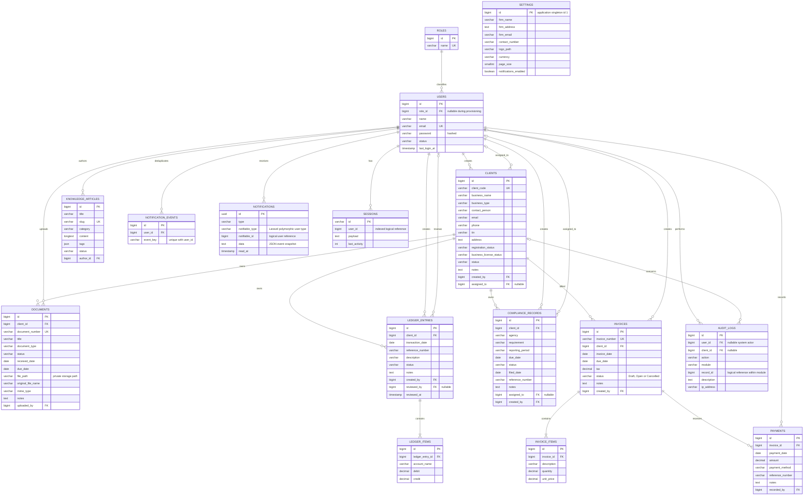
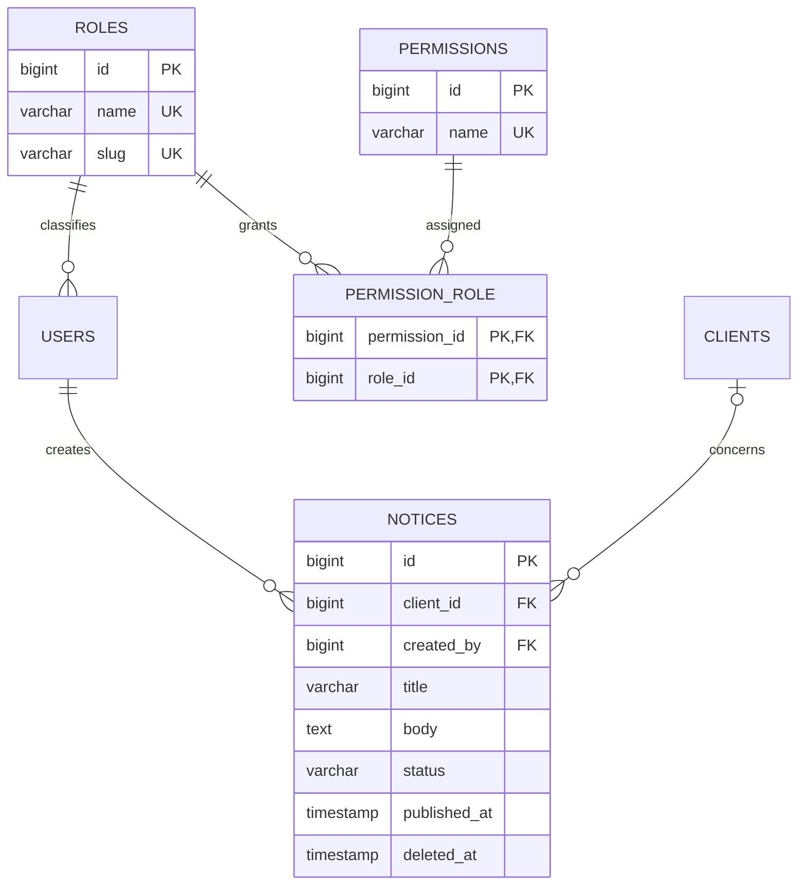

# VERITAS CORE database relationships

The authoritative column definitions, indexes and delete rules are in `database/migrations/2026_10_01_000001_create_workspace_tables.php` and Laravel's initial system migrations. The diagram below focuses on domain keys and important attributes; timestamps and soft-delete columns are omitted for readability.

## Normalization and derived values

Clients are referenced by `client_id`; business names are not duplicated in documents, ledger, compliance or invoices. Users and roles are separate entities. Ledger and invoice lines are child tables, with payments modeled separately from invoice items.

Invoice `subtotal`, `total_amount`, `amount_paid`, `balance` and item `amount` are derived accessors instead of duplicated stored totals. Line amounts round to cents; totals and payments are calculated in integer cents. Stored invoice lifecycle state is Draft/Open/Cancelled; Paid, Partially Paid and Overdue are derived from payments and dates. Compliance overdue and urgency are similarly calculated rather than storing a date-sensitive status that becomes stale.

The core financial/client relationships use normalized relational tables. Knowledge tags are a JSON list for simple article tagging; this is an intentional denormalized convenience rather than a separate tag catalog. Notifications and audit descriptions are event snapshots, so they can retain historical wording. This design does not claim strict 3NF for every ancillary field.

## Constraints and retention

- Foreign keys protect users and clients referenced by business records (`RESTRICT`). Payments also prevent physical deletion of their invoice.
- Invoice/ledger items cascade only on physical deletion of their parent. Normal application operations preserve history with soft deletion or lifecycle status changes.
- Clients, documents, ledger entries, compliance, invoices and knowledge articles have `deleted_at`. Client archiving uses `status=Archived` and can be reversed from the client profile. No application route physically deletes financial records.
- Invoice numbers, document numbers, client codes, article slugs, user emails and role names have unique indexes. Status, dates, foreign keys and commonly searched identifiers are indexed.
- `notification_events` has a unique `(user_id, event_key)` constraint for concurrent reminder deduplication. Its `user_id` has a real FK. Laravel's polymorphic `notifications.notifiable_id`, session user reference and generic audit `record_id` are logical references rather than SQL foreign keys; authorization checks the referenced record when serving notifications.
- Every invoice must have at least one item and every ledger entry at least two items, enforced by request validation and transactional writes. Submission additionally checks balanced, positive debit and credit totals. SQL foreign keys alone do not enforce these minimum child counts.
- There is no required one-to-one business relationship. Settings are a single application-level record, not a child of a specific user.

Laravel's `password_reset_tokens`, `cache`, `cache_locks`, `jobs`, `job_batches`, `failed_jobs` and `migrations` tables support authentication, throttling and framework operations. The application uses database-backed sessions/cache and synchronous notifications by default.

## Three-role RBAC extension

`roles.slug` is unique; the existing `users.role_id` remains the single-role FK mapping. The role/permission relation is many-to-many, enforced with a composite primary key and cascading foreign keys. Notices optionally belong to a client and always belong to a creator; their parent references restrict physical deletion.

